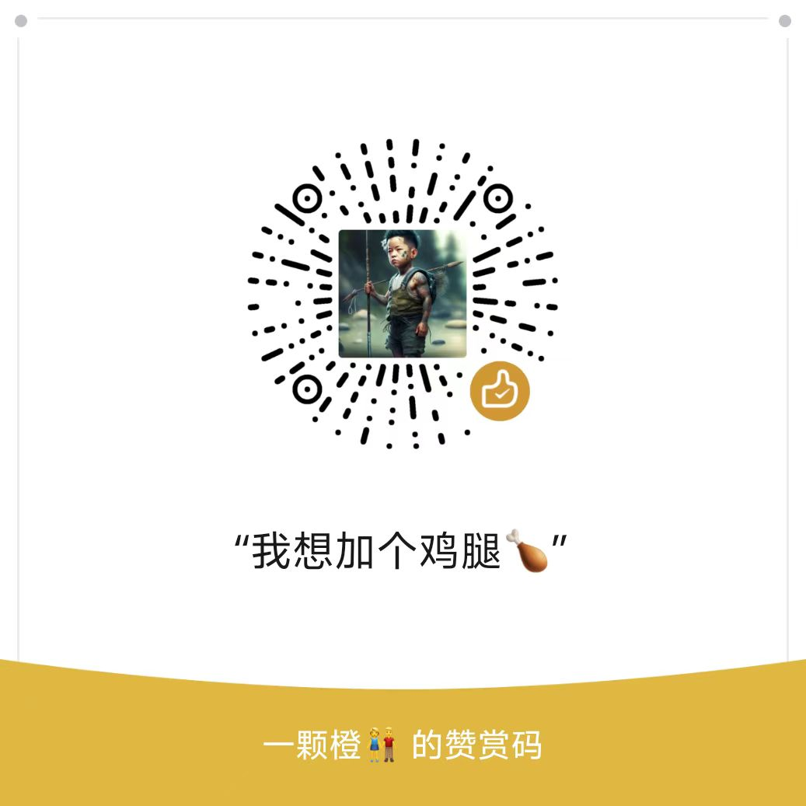

# AI Answer Assistant (AI助手)

A Chrome browser extension that helps users quickly get AI answers. | 一个帮助用户快速获取AI回答的Chrome浏览器扩展。

[English](#english) | [中文](#chinese)

## English

### Features

- 🖼️ Quick Screenshot: Support intelligent webpage area capture
- 🤖 AI Recognition: Automatically send screenshots to AI assistant
- ⚡ Real-time Response: Get professional AI answers quickly
- 🎯 Convenient Operation: Support shortcuts and right-click menu
- 🎨 Elegant Display: Clear and beautiful conversation interface

### Installation

1. Download the extension package
2. Open Chrome browser and go to extensions page (chrome://extensions/)
3. Enable Developer Mode
4. Click "Load unpacked"
5. Select the unzipped extension folder

### Usage

1. Click the extension icon in browser toolbar
2. Select webpage area for screenshot
3. Wait for AI assistant to analyze and respond
4. View AI answer results

### Shortcuts

- Start Screenshot: Alt + Shift + A
- Open Menu: Right-click extension icon

## Chinese

### 功能特点

- 🖼️ 快速截图：支持网页区域智能截图
- 🤖 AI识别：自动将截图发送至AI助手
- ⚡ 实时响应：快速获取AI的专业回答
- 🎯 便捷操作：支持快捷键和右键菜单
- 🎨 优雅展示：清晰美观的对话界面

### 安装使用

1. 下载插件压缩包
2. 打开Chrome浏览器，进入扩展程序页面（chrome://extensions/）
3. 开启开发者模式
4. 点击"加载已解压的扩展程序"
5. 选择解压后的插件文件夹

### 使用说明

1. 点击浏览器工具栏中的插件图标
2. 选择需要询问的网页区域进行截图
3. 等待AI助手分析并给出回答
4. 查看AI回答结果

### 快捷键

- 开始截图：Alt + Shift + A
- 打开菜单：右键点击插件图标

## Project Structure | 项目结构

```
ai-answer-assistant/
├── manifest.json          # Extension configuration file
├── package.json          # Project configuration file
├── README.md            # Project documentation
└── src/
    ├── assets/
    │   └── icons/       # Extension icon resources
    │       ├── icon-16.png
    │       ├── icon-32.png
    │       ├── icon-48.png
    │       └── icon-128.png
    ├── scripts/
    │   ├── background.js # Background script
    │   └── content.js    # Content script
    └── styles/
        └── content.css   # Style file
```

## Tech Stack | 技术栈

- JavaScript ES6+
- Chrome Extension API
- HTML5/CSS3

## Version Info | 版本信息

Current Version | 当前版本：v1.1.0

### Changelog | 更新日志

v1.1.0 (2024-03)
- ✨ Optimize screenshot function stability | 优化截图功能稳定性
- 🎨 Improve AI answer display effect | 改进AI回答展示效果
- 🚀 Enhance overall user experience | 提升整体用户体验
- 🐛 Fix known issues | 修复已知问题

## Development | 开发说明

### Local Development | 本地开发

1. Clone repository | 克隆仓库：

```bash
git clone https://github.com/hehehero/ai-answer-assistant.git
```

2. Load project folder in Chrome extensions page | 在Chrome扩展管理页面加载项目文件夹
3. Refresh extension after code changes | 修改代码后刷新扩展即可看到效果

## Notes | 注意事项

- Make sure to grant necessary permissions | 使用前请确保已授予插件必要的权限
- Recommended to use latest Chrome version | 建议使用最新版本的Chrome浏览器
- Check network connection if issues occur | 如遇问题请检查网络连接是否正常

## License | 许可证

MIT License

## Repository | 项目地址

- GitHub：[https://github.com/hehehero/ai-answer-assistant](https://github.com/hehehero/ai-answer-assistant)
- Gitee：[https://gitee.com/hehehero/ai-answer-assistant](https://gitee.com/hehehero/ai-answer-assistant)

## Contact | 联系方式

For issues or suggestions, please contact: | 如有问题或建议，请通过以下方式联系：
- GitHub: [@hehehero](https://github.com/hehehero)
- Gitee: [@hehehero](https://gitee.com/hehehero)

## Acknowledgments | 致谢

Thanks to all friends who provided help and suggestions for this project! | 感谢所有为本项目提供帮助和建议的朋友们！

### 🎨如果看到这里了，不妨赞赏一下作者再走吧~吃饱了才更有力气搬砖🤖


